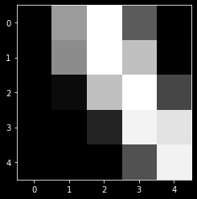
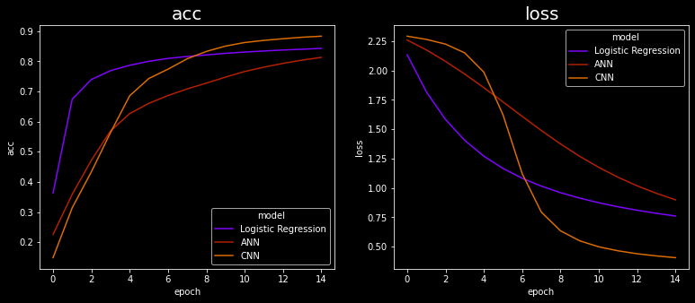

```python
import torch
import torchvision
from torchvision.datasets import MNIST
import torchvision.transforms as transforms
import torch.nn as nn
import torch.nn.functional as F
from torch.utils.data import random_split
from torch.utils.data import DataLoader
from sklearn.model_selection import train_test_split
import matplotlib.pyplot as plt
import pandas as pd
import seaborn as sns
%matplotlib inline
plt.style.use('dark_background')
```


```python
# Download training dataset
dataset      = MNIST(root='data/', download=True)
test_dataset = MNIST(root='data/', train=False)


```


```python
dataset      = MNIST(root='data/', 
                train=True,
                transform=transforms.ToTensor())
```


```python
len(dataset)
```


    60000


```python
img_tensor, label = dataset[0]
print(img_tensor.shape, label)
plt.imshow(img_tensor[0,10:15,10:15], cmap='gray');
```

    torch.Size([1, 28, 28]) 5
    


    

    


```python
print(img_tensor[0,10:15,10:15])
print(torch.max(img_tensor), torch.min(img_tensor))

```

    tensor([[0.0039, 0.6039, 0.9922, 0.3529, 0.0000],
            [0.0000, 0.5451, 0.9922, 0.7451, 0.0078],
            [0.0000, 0.0431, 0.7451, 0.9922, 0.2745],
            [0.0000, 0.0000, 0.1373, 0.9451, 0.8824],
            [0.0000, 0.0000, 0.0000, 0.3176, 0.9412]])
    tensor(1.) tensor(0.)
    


```python

train_ds, val_ds = random_split(dataset, [50000, 10000])
len(train_ds), len(val_ds)


batch_size = 128

train_loader = DataLoader(train_ds, batch_size, shuffle=True)
val_loader = DataLoader(val_ds, batch_size)

```


```python
input_size = 28*28
num_classes = 10
model = nn.Linear(input_size, num_classes)
```


```python
print(model.weight.shape)
model.weight

```

    torch.Size([10, 784])
    


    Parameter containing:
    tensor([[-5.4065e-03, -1.7109e-02,  1.0133e-02,  ..., -2.7559e-02,
             -2.8004e-02,  3.3820e-02],
            [ 2.8510e-02,  1.6116e-02,  2.9182e-02,  ...,  3.1317e-02,
              8.3074e-03, -4.7527e-03],
            [-2.6698e-02, -2.3824e-02, -3.3070e-02,  ..., -5.8687e-03,
             -2.6192e-02, -1.3244e-02],
            ...,
            [ 3.5484e-02,  2.8565e-02,  1.6381e-02,  ...,  2.7424e-03,
             -2.9390e-02, -4.4174e-03],
            [ 1.8712e-02, -2.8243e-02, -1.5098e-02,  ...,  2.2157e-02,
              2.5819e-02, -5.3298e-05],
            [-3.5229e-02, -2.0730e-02,  2.1448e-02,  ..., -1.5797e-02,
              3.1028e-02, -3.5477e-02]], requires_grad=True)


```python
print(model.bias.shape)
model.bias

```

    torch.Size([10])
    


    Parameter containing:
    tensor([-0.0192,  0.0188,  0.0064, -0.0223,  0.0032, -0.0280,  0.0281, -0.0107,
            -0.0012, -0.0329], requires_grad=True)


```python

```


```python
class MnistModel(nn.Module):
    def __init__(self):
        super().__init__()
        self.linear = nn.Linear(input_size, num_classes)
        
    def forward(self, xb):
        xb = xb.reshape(-1, 784)
        out = self.linear(xb)
        return out
    
class ANN(nn.Module):
    def __init__(self):
        super(ANN, self).__init__()
        self.fc1 = nn.Linear(input_size, 50)
        self.fc2 = nn.Linear(50, num_classes)
        
    def forward(self, x):
        x = x.reshape(-1,784)
        x = F.relu(self.fc1(x))
        x = self.fc2(x)
        return x
    
    
class CNN(nn.Module):
    def __init__(self, in_channels=1, num_classes = 10):
        super(CNN,self).__init__()
        self.conv1 = nn.Conv2d(in_channels = 1, out_channels= 8, kernel_size = (3,3), stride = (1,1), padding = (1,1))
        self.pool = nn.MaxPool2d(kernel_size = (2,2), stride = (2,2))
        self.conv2 = nn.Conv2d(in_channels = 8, out_channels = 16, kernel_size = (3,3), stride = (1,1), padding = (1,1))
        self.fc1 = nn.Linear(16*7*7, num_classes)
        
    def forward(self, x):
        x = F.relu(self.conv1(x))
        x = self.pool(x)
        x = F.relu(self.conv2(x))
        x = self.pool(x)
        x = x.reshape(-1,784)
        x = self.fc1(x)
        return x
    

    
model = MnistModel()
ann = ANN()
cnn = CNN()

```


```python
model.linear
```


    Linear(in_features=784, out_features=10, bias=True)


```python
print(model.linear.weight.shape, model.linear.bias.shape)
list(model.parameters())
```

    torch.Size([10, 784]) torch.Size([10])
    


    [Parameter containing:
     tensor([[ 0.0031, -0.0256,  0.0279,  ..., -0.0046,  0.0335,  0.0251],
             [ 0.0115,  0.0246,  0.0097,  ...,  0.0227, -0.0256, -0.0090],
             [-0.0252, -0.0028,  0.0236,  ...,  0.0272, -0.0269, -0.0150],
             ...,
             [-0.0013, -0.0002, -0.0137,  ..., -0.0332, -0.0023,  0.0201],
             [ 0.0349,  0.0222,  0.0222,  ...,  0.0018, -0.0244,  0.0131],
             [ 0.0168,  0.0346, -0.0130,  ...,  0.0122,  0.0131,  0.0053]],
            requires_grad=True),
     Parameter containing:
     tensor([-0.0097, -0.0296, -0.0052, -0.0047,  0.0218,  0.0356,  0.0293, -0.0318,
              0.0061, -0.0107], requires_grad=True)]


```python
for images, labels in train_loader:
    print(images.shape)
    outputs = model(images)
    break

print('outputs.shape : ', outputs.shape)
print('Sample outputs :\n', outputs[:2].data)
```

    torch.Size([128, 1, 28, 28])
    outputs.shape :  torch.Size([128, 10])
    Sample outputs :
     tensor([[-0.0292, -0.2660, -0.2048, -0.0064,  0.0903,  0.1559,  0.0012,  0.1838,
             -0.0635,  0.0050],
            [ 0.1427, -0.0075, -0.1116,  0.0877,  0.1359, -0.0299, -0.2174,  0.1149,
             -0.0769, -0.0589]])
    


```python
def accuracy(outputs, labels):
    _, preds = torch.max(outputs, dim=1)
    return torch.tensor(torch.sum(preds == labels).item() / len(preds))
def ann_accuracy(outputs, labels):
    _, preds = torch.max(outputs, dim=1)
    return torch.tensor(torch.sum(preds == labels).item().float() / float(preds.size(0)))

```


```python
accuracy(outputs, labels)
```


    tensor(0.1094)


```python
loss_fn = F.cross_entropy
criterion = nn.CrossEntropyLoss()
optimizer = torch.optim.SGD(model.parameters(), lr=0.001)
ann_optimizer = torch.optim.SGD(ann.parameters(), lr=0.001)
cnn_optimizer = torch.optim.SGD(cnn.parameters(), lr=0.001)
device = torch.device("cuda:0" if torch.cuda.is_available() else "cpu")
!nvidia-smi
model = model.to(device)
ann = ann.to(device)
cnn = cnn.to(device)
```

    Tue Mar 02 19:40:56 2021       
    +-----------------------------------------------------------------------------+
    | NVIDIA-SMI 431.84       Driver Version: 431.84       CUDA Version: 10.1     |
    |-------------------------------+----------------------+----------------------+
    | GPU  Name            TCC/WDDM | Bus-Id        Disp.A | Volatile Uncorr. ECC |
    | Fan  Temp  Perf  Pwr:Usage/Cap|         Memory-Usage | GPU-Util  Compute M. |
    |===============================+======================+======================|
    |   0  GeForce GTX 105... WDDM  | 00000000:01:00.0 Off |                  N/A |
    | N/A   40C    P0    N/A /  N/A |     75MiB /  4096MiB |      1%      Default |
    +-------------------------------+----------------------+----------------------+
                                                                                   
    +-----------------------------------------------------------------------------+
    | Processes:                                                       GPU Memory |
    |  GPU       PID   Type   Process name                             Usage      |
    |=============================================================================|
    |  No running processes found                                                 |
    +-----------------------------------------------------------------------------+
    


```python

```


```python
epochs_data = []
acc_data = []
loss_data = []
history =[]
for epoch in range(15):
    for images, labels in train_loader:
        images = images.to(device)
        labels = labels.to(device)
        outputs = model(images)
        acc = accuracy(outputs, labels)
        loss = loss_fn(outputs, labels)
        acc_log = torch.mean(acc)
        loss_log = torch.mean(loss)
        epochs_data.append(epoch)
        acc_data.append(acc_log.item())
        loss_data.append(loss_log.item())
        optimizer.zero_grad()
        loss.backward()
        optimizer.step()
        
        print('epoch : {}, accuracy : {}, loss = {}'.format(epoch, acc_log, loss_log ))
```

 
    


```python
history = pd.DataFrame({'epoch' : epochs_data , 'loss' : loss_data, 'acc' : acc_data })

```


```python

ann_epochs_data = []
ann_acc_data = []
ann_loss_data = []
ann_history =[]
for epoch in range(15):
    for images, labels in train_loader:
        images = images.to(device)
        labels = labels.to(device)
        ann_outputs = ann(images)
        ann_acc = accuracy(ann_outputs, labels)
        ann_loss = criterion(ann_outputs, labels)
        ann_acc_log = torch.mean(ann_acc)
        ann_loss_log = torch.mean(ann_loss)
        ann_epochs_data.append(epoch)
        ann_acc_data.append(ann_acc_log.item())
        ann_loss_data.append(ann_loss_log.item())
        ann_optimizer.zero_grad()
        ann_loss.backward()
        ann_optimizer.step()
        
        print('epoch : {}, accuracy : {}, loss = {}'.format(epoch, ann_acc_log, ann_loss_log ))
        
        
ann_history = pd.DataFrame({'epoch' : ann_epochs_data , 'loss' : ann_loss_data, 'acc' : ann_acc_data })

```

    
    


```python

cnn_epochs_data = []
cnn_acc_data = []
cnn_loss_data = []
cnn_history =[]
for epoch in range(15):
    for images, labels in train_loader:
        images = images.to(device)
        labels = labels.to(device)
        cnn_outputs = cnn(images)
        cnn_acc = accuracy(cnn_outputs, labels)
        cnn_loss = criterion(cnn_outputs, labels)
        cnn_acc_log = torch.mean(cnn_acc)
        cnn_loss_log = torch.mean(cnn_loss)
        cnn_epochs_data.append(epoch)
        cnn_acc_data.append(cnn_acc_log.item())
        cnn_loss_data.append(cnn_loss_log.item())
        cnn_optimizer.zero_grad()
        cnn_loss.backward()
        cnn_optimizer.step()
        
        print('epoch : {}, accuracy : {}, loss = {}'.format(epoch, cnn_acc_log, cnn_loss_log ))
        
        
cnn_history = pd.DataFrame({'epoch' : cnn_epochs_data , 'loss' : cnn_loss_data, 'acc' : cnn_acc_data })
```

   
    


```python
history              = history.groupby('epoch')['loss','acc'].mean().reset_index()
ann_history          = ann_history.groupby('epoch')['loss','acc'].mean().reset_index()
cnn_history          = cnn_history.groupby('epoch')['loss','acc'].mean().reset_index()
history['model']     = 'Logistic Regression'
ann_history['model'] = 'ANN'
cnn_history['model'] = 'CNN'
history_all = pd.concat([history,ann_history,cnn_history],ignore_index=True)
```

    c:\users\fikri\appdata\local\programs\python\python37\lib\site-packages\ipykernel_launcher.py:1: FutureWarning: Indexing with multiple keys (implicitly converted to a tuple of keys) will be deprecated, use a list instead.
      """Entry point for launching an IPython kernel.
    c:\users\fikri\appdata\local\programs\python\python37\lib\site-packages\ipykernel_launcher.py:2: FutureWarning: Indexing with multiple keys (implicitly converted to a tuple of keys) will be deprecated, use a list instead.
      
    c:\users\fikri\appdata\local\programs\python\python37\lib\site-packages\ipykernel_launcher.py:3: FutureWarning: Indexing with multiple keys (implicitly converted to a tuple of keys) will be deprecated, use a list instead.
      This is separate from the ipykernel package so we can avoid doing imports until
    


```python
cat = ['acc','loss']
plt.figure(figsize=(20,5))
for index, col in enumerate(cat, start=1):
    plt.subplot(1,3,index)
    plt.title(col,size=20)
    sns.lineplot(x='epoch', y=col,hue='model',palette='gnuplot',data=history_all)
    
    
```


    

    


```python
epoch_last = (history_all['epoch'] == 14)
last = history_all.loc[epoch_last,['model','acc','loss']].sort_values(['acc','loss'],ascending=False).reset_index(drop=True)
last
```


<div>
<style scoped>
    .dataframe tbody tr th:only-of-type {
        vertical-align: middle;
    }

    .dataframe tbody tr th {
        vertical-align: top;
    }

    .dataframe thead th {
        text-align: right;
    }
</style>
<table border="1" class="dataframe">
  <thead>
    <tr style="text-align: right;">
      <th></th>
      <th>model</th>
      <th>acc</th>
      <th>loss</th>
    </tr>
  </thead>
  <tbody>
    <tr>
      <th>0</th>
      <td>CNN</td>
      <td>0.883144</td>
      <td>0.406902</td>
    </tr>
    <tr>
      <th>1</th>
      <td>Logistic Regression</td>
      <td>0.842807</td>
      <td>0.761453</td>
    </tr>
    <tr>
      <th>2</th>
      <td>ANN</td>
      <td>0.812864</td>
      <td>0.899561</td>
    </tr>
  </tbody>
</table>
</div>


